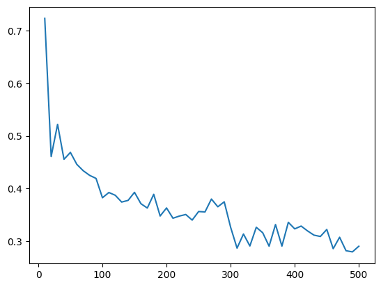
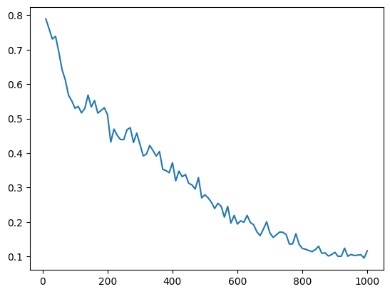

# AUTO-SIAMESE -A Verfication architecture

## Introduction

the siamese network has showed great success in face verification task and the auto encoders have proven to be a useful tool in unsupervised learning.so in this project we try explore a combination of these two for task of signature verification.the siamese network tries to place similar obejcts closer in the latent space and dissimilar further away this property is somewhat similar to principle on which auto encoders work they bound objects belonging to simillar class i some volume of the latent space.

## Dataset

in this project we have tested our model on CEDAR and BHsig-260 hindi.

### CEDAR Dataset

The CEDAR dataset primarily contains signatures written in the English alphabet. The dataset was collected for research purposes, focusing on the verification of handwritten signatures rather than on the language itself.

#### Key Features

* **Variety** : The dataset includes a wide range of signatures from different individuals, providing a diverse set of handwriting styles.
* **Annotations** : Each signature is labeled as either genuine or forged, facilitating supervised learning approaches for verification tasks.

### BHsig-hindi Dataset

The BHsig-hindi dataset consists of handwritten signatures in Hindi, specifically collected for research in signature verification. It includes both genuine and forged signatures.

#### Key Features

* **Language** : Signatures are written in Hindi, providing data for research in Hindi script signature verification.
* **Variety** : The dataset features a wide range of signatures from different individuals, showcasing various handwriting styles.

## Model Architecture

The project consists of two main models:

### 1.AutoEncoder

The `AutoEncoder` is a convolutional autoencoder model designed for image compression and reconstruction. It consists of two main components: an encoder and a decoder, along with an additional feature extractor network.

#### Components

1. **Encoder** : The encoder comprises convolutional layers followed by max pooling layers. It progressively downsamples the input image to extract essential features.
2. **Decoder** : The decoder uses transposed convolutional layers (also known as deconvolution layers) to upsample and reconstruct the image back to its original size.
3. **Feature Extractor** : This network consists of fully connected layers that generate a compact encoded representation of the input image.

#### Forward Pass

* The model takes two input image batches, `x` and `y`.
* Each image batch is passed through the encoder to produce an encoded representation.
* The encoded representation is flattened and passed through the feature extractor.
* The decoder reconstructs the original image from the encoded representation.
* The model outputs the reconstructed images and their encoded representations.

#### Usage

* **Input** : Two batches of images (e.g., grayscale images with a single channel).
* **Output** : Reconstructed images and encoded representations for both input batches.

---

### 2.SimNet

The `SimNet` is a similarity network designed to compare encoded image representations from the `AutoEncoder`.

#### Components

* **Fully Connected Network** : This network computes a similarity score between the encoded representations of two image batches. It consists of fully connected layers with dropout for regularization.

#### Forward Pass

* The network calculates the difference between the encoded representations of two images.
* This difference is passed through the fully connected network to produce a similarity score, which is squashed between 0 and 1 using a sigmoid activation function.

#### Usage

* **Input** : Encoded representations from the `AutoEncoder`.
* **Output** : A similarity score indicating how similar the two encoded representations are.

## RanaKaGhata Loss Function

The `RanaKaGhata` loss function is a custom loss module designed for use with convolutional autoencoder models. It combines two different loss components: L1 loss for image reconstruction and binary cross-entropy loss for similarity prediction.

### Components

1. **Reconstruction Loss (L1 Loss)** :

* Measures the difference between the original and reconstructed images using L1 loss, which calculates the absolute differences.
* Ensures the reconstructed images are as close as possible to the original images.

1. **Similarity Loss (Binary Cross-Entropy Loss)** :

* Measures the difference between predicted similarity scores and true labels.
* Used to train the model to predict similarity scores that match the ground truth labels (0 for dissimilar, 1 for similar).

### Parameters

* **Beta (`beta`)** : A weighting factor that balances the contribution of the reconstruction and similarity loss components in the overall loss.

### Usage

* **Input** :
* `x_orig` and `y_orig`: Original input images.
* `x_predict` and `y_predict`: Reconstructed images from the autoencoder.
* `sim`: Predicted similarity scores.
* `label`: True similarity labels (binary).
* **Output** : A combined loss value that guides the model to improve both image reconstruction and similarity prediction performance.

## Training

To train the models, run the `train()` function in the script. The training process involves:

1. Loading the dataset using PyTorch DataLoader.
2. Initializing the models and loss function (`RanaKaGhata`).
3. Using Adam optimizers with a cosine annealing scheduler for learning rate adjustments.
4. Training the models over multiple epochs and printing the loss at regular intervals.
5. Saving the trained models' state.

The models are trained to minimize the reconstruction error and the similarity error simultaneously.

## Evaluation

The `check_accuracy()` function is used to evaluate the models on the test dataset. It calculates the accuracy by comparing predicted similarity scores against true labels. The evaluation is performed after certain number of epochs during training to observe if and when the model starts to overfit.

## Results

After training, the models are saved to disk. The training loss is plotted over the iterations to visualize convergence. The accuracy on the test dataset is also printed after each epoch to monitor performance.

(the results show cased were obatined using 80-20 train-test split where 80% of total unique id signature were used for training ad 20% were used for testing)

### CEDAR Dataset

training accuracy-0.99% testing -0.99%

**loss functin plot**

### BHsig260-hindi

training accuracy-0.9941

testing accuracy-0.8489

**loss function plot**

